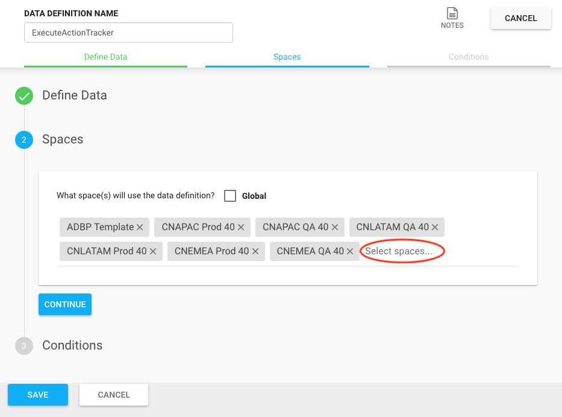
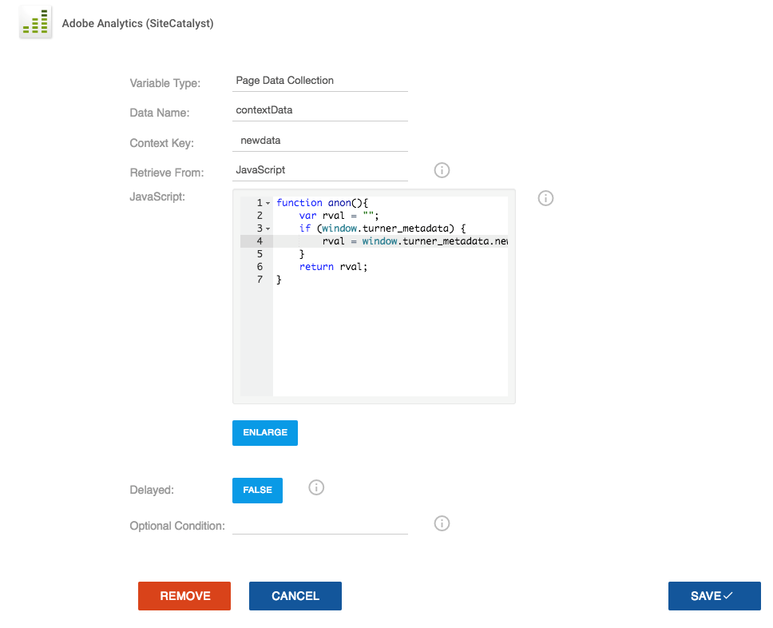
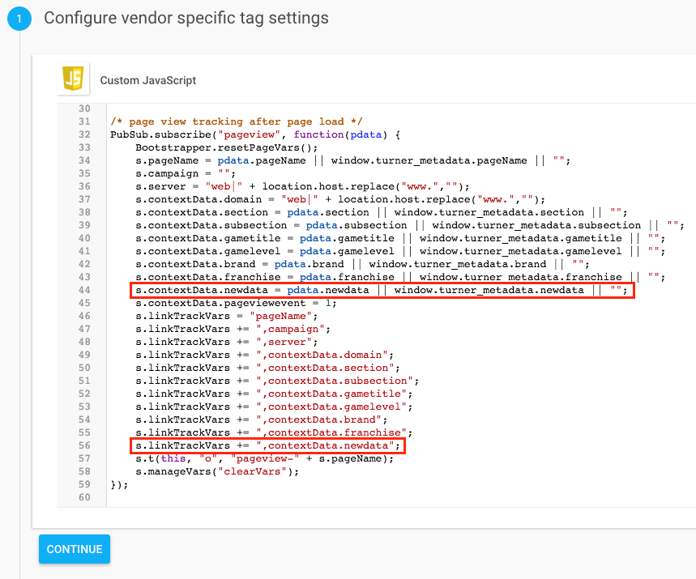
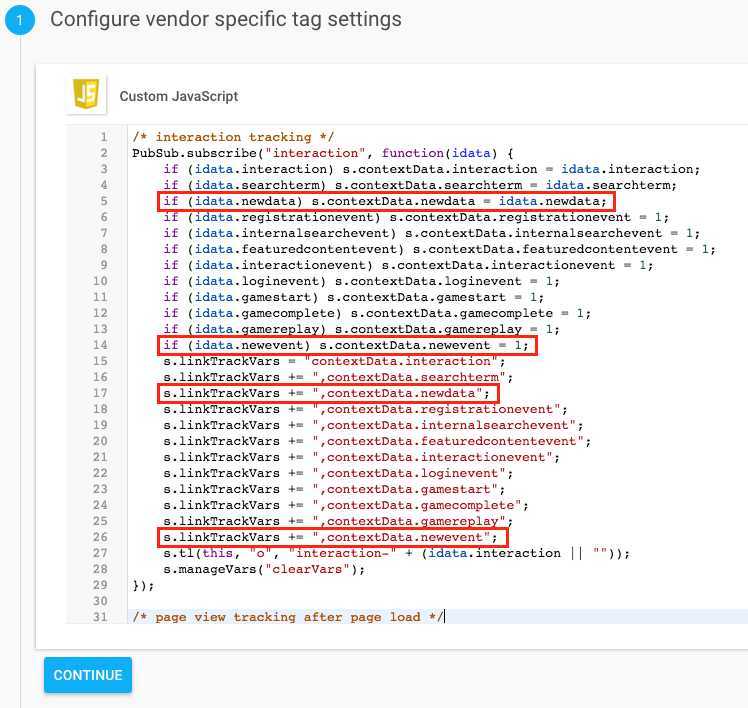
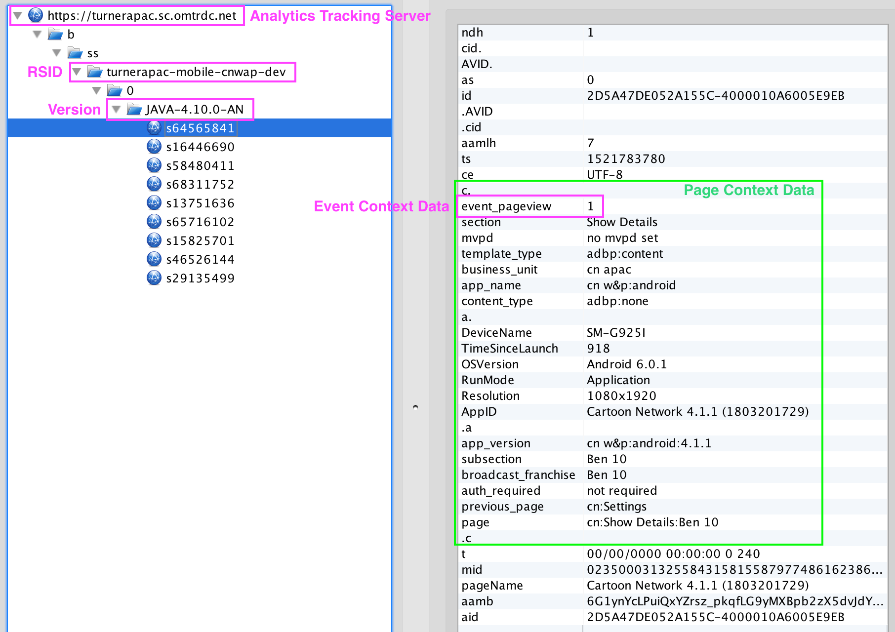
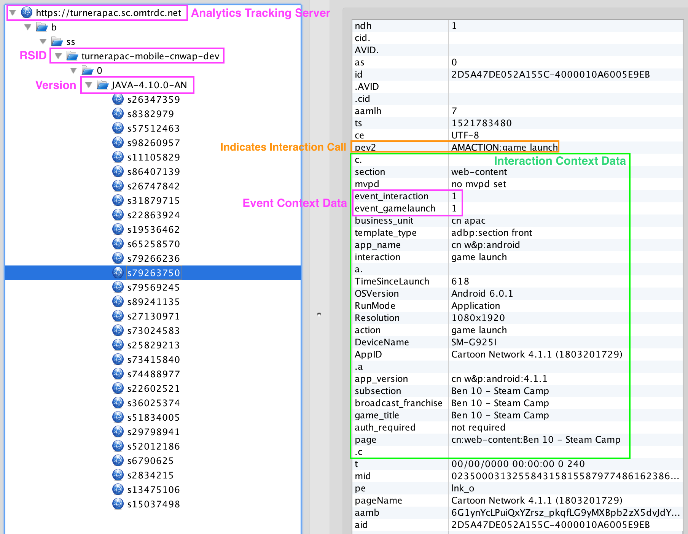
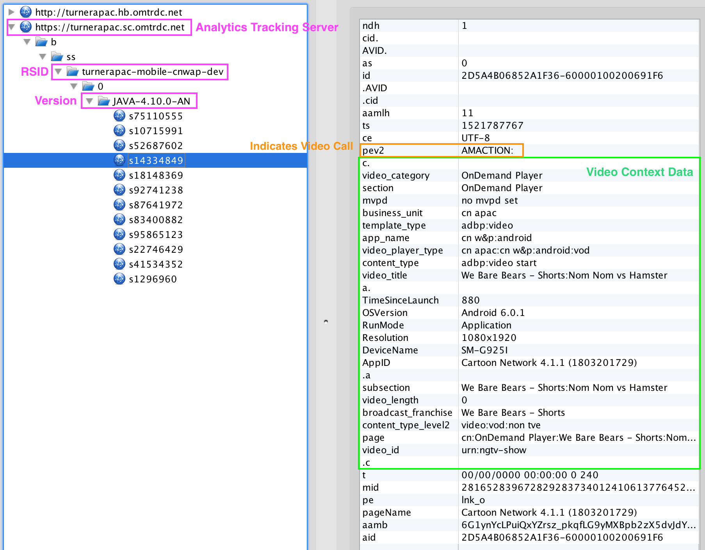
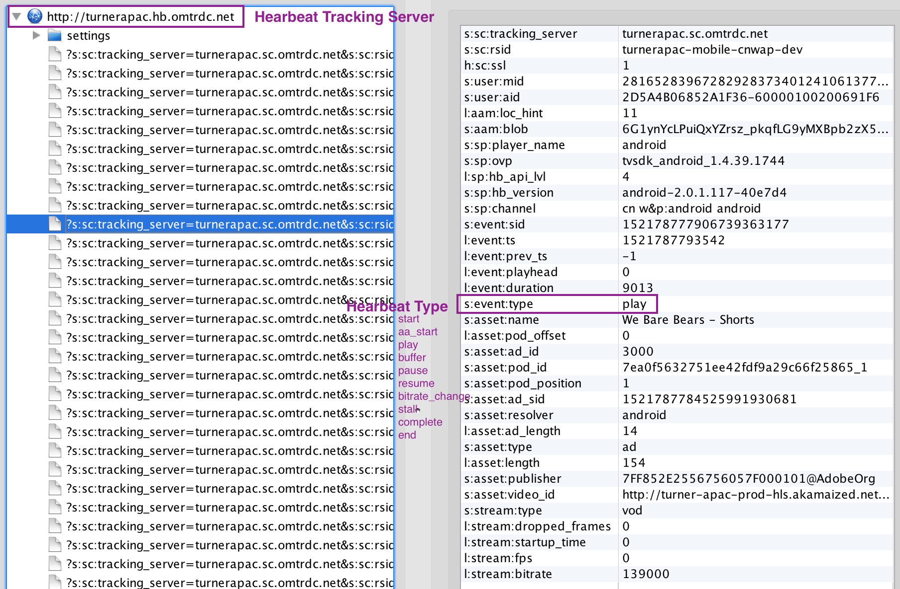

# Prerequisites

* Analytics SDR 
* Access to Ensighten 
* Adobe configuration values :
	* Report Suite ID (rsid)
	* Adobe Login Company – select from below table
	* Secure Tracking Server – select from below table
	* Non-Secure Tracking Server – select from below table
	* Namespace – select from below table
		

Adobe Login Company | Secure and Non-Secure Tracking Server | Namespace
---------------| ------- | -----------
Cartoon Network New Media | cartoonnetworknewmedia.d2.sc.omtrdc.net | cartoonnetworknewmedia
TBS Latin America | tbslatinamerica.207.net | tbslatinamerica
Turner APAC |turnerapac.sc.omtrdc.net | turnerapac
Turner UK |turneruk.2o7.net | turneruk
Turner International   |turnerinternational.sc.omtrdc.net | turnerinternational

# Ensighten Documentation

It is recommended to go through training videos before using Ensighten.

* Training Videos: <a href='https://www.ensighten.com/training/manage-technical/'>https://www.ensighten.com/training/manage-technical/</a></li>
* Adobe Training Videos: <a href='https://www.ensighten.com/training/sitecatalyst-implementation-via-manage/'>https://www.ensighten.com/training/sitecatalyst-implementation-via-manage/</a></li>
* Recommended Tools: <a href='https://www.ensighten.com/training/tools/'> https://www.ensighten.com/training/tools/</a></li>

# Helpful Contacts

* Any questions – contact <a href='#'> adaqdev@turner.com</a></li> 


# Ensighten Implementation

1). Create a new space in Ensighten Manage and make a note of the Bootstrap include script.

Example:

`<script type="text/javascript" src="//nexus.ensighten.com/turnerintl/example-space/Bootstrap.js"></script>`


## Best Practices

* Create a space per environment: **production** and **non-production** environments.
* Add a server side **kill switch** for the Bootstrap.  In case of the Ensighten causing any issues on the site, you can easily take it out.
* Add an **environment logic** to automatically load production vs non-production Bootstrap.
* Enable **Tag Alerts** and **Publish Alerts** (Click **turnerintl** in the top right and select **settings**), so you get a notification email when someone publishes in your space.

2). Add newly recreated space(s) to the **ExecuteActionTracker** Data Definition within Ensighten.



3). Merge all tags from **ADBP Template** space to your new space.  <u>Make sure to merge all tags together</u>.

  Here are descriptions for each tag in **ADBP Template** space:
  
  * **Adobe Analytics – All Page View** – handles every page view on the site
  * **Adobe Analytics – Base Code** – holds the Adobe AppMeasurement Library
  * **Adobe Analytics – Marketing Cloud Visitor ID** – holds the Adobe Visitor Library
  *	**Adobe Analytics – Page Events** – handles interaction events and post page load events
  * **Adobe Analytics – Video Heartbeat Library** – handles Adobe video tracking
  * **ServerComponent Override** – allows debugging from any protocols (e.g. file://)
  * **trackMetrics PubSub Publisher** – handles video and interaction events with PubSub library
  * **ActionTracker** – provides methods for post page load tracking (discussed under Track Action Array)

4). Update **rsid**, **trackingServer**, **trackingServerSecure**, **visitorNamespace** and **linkInternalFilters** values in **Adobe Analytics – Base Code** tag.

> Example:

```javascript
if (Bootstrapper.ensightenOptions.publishPath == "adbp-prod") {
  var rsid = "turnerintcartoon";
} else {
  var rsid = "turnerintcartoondev";
}
s.trackingServer = "turnerinternational.sc.omtrdc.net";
s.trackingServerSecure = "turnerinternational.sc.omtrdc.net";
s.visitorNamespace = "turnerinternational";
s.linkInternalFilters = "javascript:,example.com,example.net";  //include all your domains
```

5). Update the following Adobe VHL (Video Heartbeat Library) configuration in **Adobe Analytics - Video Heartbeat Library** tag.

* **mediaConfig.trackingServer** – <namespace>.hb.omtrdc.net
* **mediaConfig.playerName** – name of your video player (e.g. AVPlayer, HTML5 Player)
* **mediaConfig.channel** – name of your channel
* **mediaConfig.appVersion** – version of your video player
* **mediaConfig.ovp** – name of online video platform through which content gets distributed

> Example:

```javascript
var mediaConfig = new MediaHeartbeatConfig();
mediaConfig.trackingServer = "turnerinternational.hb.omtrdc.net";
mediaConfig.playerName = "example player";
mediaConfig.channel = "example channel";
mediaConfig.debugLogging = false;
mediaConfig.appVersion = "example 1.2.3";
mediaConfig.ssl = false;
mediaConfig.ovp = "example ovp";
```
##Commit vs Publish

Ensighten offers two different Bootstrap.js domains depending on the status of your tag.

* When a tag is **committed**, it is moved to **nexus-test.ensighten.com** domain.
* When a tag is **published**, it is moved to **nexus.ensighten.com** domain.

This is often helpful moving changes to a production environment.  After merging all changes to the production space within Ensighten; commit the tags and use the nexus-test.ensighten.com domain to verify the changes before publishing. Typically, this is done via a local proxy, such as Charles Proxy or using the Ensighten Browser Extension. 

Example:

`//nexus-test.ensighten.com/turnerintl/example-space/Bootstrap.js`


# Site Implementation (Global Standard)
> Example:

```javascript
<html>
        <head>
            <script>
                var turner_metadata = {
                    "products": "category;product;quantity;price",
                    "productsevent": "prodView or purchase",
                    "section": "site section",
                    "searchterm": "search term",
                    "region": "region",
                    "subregion": "subregion",
                    "country": "country",
                    "brand": "brand of the site",
                    "franchise": "franchise of content",
                    "subsection": "site section level 2",
                    "contenttype": "content type",
                    "contenttitle": "content title",
                    "contentID": "content ID",
                    "adobehashid": "adobe hash ID",
                    "authorizedvhl": "authorized",
                    "presentationtemplate": "presentation template",
                    "featuredcontent": "featured content",
                    "registration": "description of registration",
                    "logintype": "login type",
                    "authstate": "authentication state of user",
                    "englishname": "english name",
                    "gametitle": "game title",
                    "gamelevel": "game level reached",
                    "gamemilstone": "game milestone",
                    "micrositename": "microsite name",
                    "micrositeadv": "microsite advertiser",
                    "trackAction" : []
                };
            </script>
            <script src="//nexus.ensighten.com/turnerintl/example-space/Bootstrap.js"></script>
        </head>
</html>

```
A global standards implementation starts with two steps. In the <head> of every page:
<ol type="1" class="steps_1">
<li>Add a JavaScript Object named turner_metadata</li>
<li>Add a call to an external JavaScript file; the Ensighten Bootstrap.js</li>
</ol>

## Turner Metadata Object

In the context of HTML based content (e.g., web sites), the turner_metadata object is:
<ul class="bullets_2">
<li>A window-scoped variable</li>
<li>Defined as turner_metadata</li>
<li>Follows JSON Syntax </li>
</ul>

### Basic Properties

<ul class="outer-nav">
<li>Object Keys
<ul class="mid-list">
<li>ISO Basic Latin Alphabet (See following ISO Basic Latin Alphabet table)</li>
<li>Wrapped in quotes (Unicode U+0022)</li>
</ul>
</li>
<li>Object Values
<ul class="mid-list">
<li>Preferred Characters:
<ul class="inner-list">
<li>"ISO Basic Latin Alphabet" (See following ISO Basic Latin Alphabet table)</li>
<li>Integers 0-9 (Unicode U+0030 through U+0039)</li>
<li>White Space (Unicode U+0020)</li>
<li>Delimiter "|" (Unicode U+007C)</li>
</ul>
</li>
<li>Wrapped in quotes (Unicode U+0022) </li>
<li>Exceptions for object values:
<ul class="inner-list">
<li>Quotes are omitted from integer values</li>
<li>LATAM Additional Characters:
<ul class="inner-most-list">
<li>ES Language Sites (See following LATAM-Only Spanish Characters table)</li>
<li>PT Language Sites (See following LATAM-Only Portuguese Characters table)</li>
</ul></li>
<li>An array is added to turner_metadata object under the object key trackAction. As discussed later in the documentation this array is used for post page load tracking.</li>
</ul>
</li>
</ul>
</li>
<li> General Notes 
<ul class="mid-list">
<li>Avoid Reserved & Unreserved Characters where possible per RFC 
3986 <a href="https://tools.ietf.org/html/rfc3986#section-2.2">https://tools.ietf.org/html/rfc3986#section-2.2</a>
</li>
</ul></li>
</ul>

   ISO Basic Latin Alphabet
   <table>
      <thead>
         <tr>
            <th>Character</th>
            <th>Unicode Value</th>
         </tr>
      </thead>
      <tbody>
         <tr>
            <td>a</td>
            <td>U+0061</td>
         </tr>
         <tr>
            <td>b</td>
            <td>U+0062</td>
         </tr>
         <tr>
            <td>c</td>
            <td>U+0063</td>
         </tr>
         <tr>
            <td>d</td>
            <td>U+0064</td>
         </tr>
         <tr>
            <td>e</td>
            <td>U+0065</td>
         </tr>
         <tr>
            <td>f</td>
            <td>U+0066</td>
         </tr>
         <tr>
            <td>g</td>
            <td>
               U+0067
            </td>
         </tr>
         <tr>
            <td>h</td>
            <td>
               U+0068
            </td>
         </tr>
         <tr>
            <td>i</td>
            <td>
               U+0069
            </td>
         </tr>
         <tr>
            <td>j</td>
            <td>
               U+006A
            </td>
         </tr>
         <tr>
            <td>k</td>
            <td>
               U+006B
            </td>
         </tr>
         <tr>
            <td>l</td>
            <td>
               U+006C
            </td>
         </tr>
         <tr>
            <td>m</td>
            <td>
               U+006D
            </td>
         </tr>
         <tr>
            <td>n</td>
            <td>
               U+006E
            </td>
         </tr>
         <tr>
            <td>o</td>
            <td>
               U+006F
            </td>
         </tr>
         <tr>
            <td>p</td>
            <td>
               U+0070
            </td>
         </tr>
         <tr>
            <td>q</td>
            <td>
               U+0071
            </td>
         </tr>
         <tr>
            <td>r</td>
            <td>
               U+0072
            </td>
         </tr>
         <tr>
            <td>s</td>
            <td>
               U+0073
            </td>
         </tr>
         <tr>
            <td>t</td>
            <td>
               U+0074
            </td>
         </tr>
         <tr>
            <td>u</td>
            <td>
               U+0075
            </td>
         </tr>
         <tr>
            <td>v</td>
            <td>
               U+0076
            </td>
         </tr>
         <tr>
            <td>w</td>
            <td>
               U+0077
            </td>
         </tr>
         <tr>
            <td>x</td>
            <td>
               U+0078
            </td>
         </tr>
         <tr>
            <td>y</td>
            <td>U+0079</td>
         </tr>
         <tr>
            <td>z</td>
            <td>U+007A</td>
         </tr>
      </tbody>
   </table>
   
   
   LATAM-Only Portuguese Characters
   <table>
   <thead>
      <tr>
         <th>Character</th>
         <th>Unicode Value</th>
      </tr>
   </thead>
   <tbody>
      <tr>
         <td>&#224;</td>
         <td>U+00E0</td>
      </tr>
      <tr>
         <td>&#225;</td>
         <td>U+00E1</td>
      </tr>
      <tr>
         <td>&#226;</td>
         <td>U+00E2</td>
      </tr>
      <tr>
         <td>&#227;</td>
         <td>U+00E3</td>
      </tr>
      <tr>
         <td>&#231;</td>
         <td>U+00E7</td>
      </tr>
      <tr>
         <td>&#233;</td>
         <td>U+00E9</td>
      </tr>
      <tr>
         <td>&#234;</td>
         <td>U+00EA         </td>
      </tr>
      <tr>
         <td>&#237;</td>
         <td>
            U+00ED
         </td>
      </tr>
      <tr>
         <td>&#243;</td>
         <td>
           U+00F3
         </td>
      </tr>
      <tr>
         <td>&#244;</td>
         <td>
           U+00F4
         </td>
      </tr>
      <tr>
         <td>&#245;</td>
         <td>
            U+00F5
         </td>
      </tr>
      <tr>
         <td>&#250;</td>
         <td>
            U+00FA
         </td>
      </tr>
	  <tr>
	  <td>&#252;</td>
	  <td>U+00FC</td>
	  </tr>
	  </tbody>
	  </table>
	  
LATAM-Only Spanish Characters
   <table>
   <thead>
      <tr>
         <th>Character</th>
         <th>Unicode Value</th>
      </tr>
   </thead>
   <tbody>
      
      <tr>
         <td>&#225;</td>
         <td>U+00E1</td>
      </tr>
      
      <tr>
         <td>&#233;</td>
         <td>U+00E9</td>
      </tr>
      <tr>
         <td>&#234;</td>
         <td>U+00EA         </td>
      </tr>
	  <tr>
         <td>&#237;</td>
         <td>
            U+00ED
         </td>
      </tr>
      <tr>
         <td>&#243;</td>
         <td>
           U+00F3
         </td>
      </tr>
      
      <tr>
         <td>&#250;</td>
         <td>
            U+00FA
         </td>
      </tr>
	  <tr>
	  <td>&#241;;</td>
	  <td>U+00F1</td>
	  </tr>
	  <tr>
	  <td>&#252;</td>
	  <td>U+00FC</td>
	  </tr>
	  </tbody>
	  </table>


<aside class="warning">Inside HTML code blocks like this one, you can't use Markdown, so use <code>&lt;code&gt;</code> blocks to denote code.</aside>


## Track Action Array

The trackAction array, as outlined by the Turner Metadata Object specification, is utilized in post page load tracking.  Tracked activities may be pushed into the trackAction array before analytics tools have finished loading. 

This method of post page load tracking utilizes two custom functions:
<ul class="outer-list"><li>actionTracker – A custom JavaScript library which:
<ul class="mid-list">
<li>Reads and tracks "stored" values in the array </li>
<li>Once complete, overwrites the push method only on the trackAction array</li>
</ul></li>
<li>trackData – An intermediate function which routes calls to the appropriate tracking function</li></ul>

In a standard implementation the actionTracker library is initialized within Ensighten using the following. <br>

<code>Bootstrapper.actionTracker.add("turner_metadata", "trackAction", Bootstrapper.trackData);</code></br>

Where:
<ul class="outer-list">
<li>"turner_metadata" is the metadata object containing the target array</li>
<li>"trackAction" is the target array</li>
<li>"Bootstrapper.trackData" is the function called to handle tracking</li>
</ul>


## Single-Page Applications

The Bootstrap.js include will send a page view for initial page load only.  To manually send page views, use the following snippet.  If the automatic initial page load call is not desired, disable the **Adobe Analytics – All Page View** tag and use the following snippet to trigger a page view manually.

> Example

```javascript

turner_metadata.trackAction.push({
        "type" : "pageview",
        "data" : {
        "products": "category;product;quantity;price",
        "productsevent": "prodView or purchase",
        "section": "site section",
        "searchterm": "search term",
        "region": "region",
        "subregion": "subregion",
        "country": "country",
        "brand": "brand of the site",
        "franchise": "franchise of content",
        "subsection": "site section level 2",
        "contenttype": "content type",
        "contenttitle": "content title",
        "contentID": "content ID",
        "adobehashid": "adobe hash ID",
        "authorizedvhl": "authorized",
        "presentationtemplate": "presentation template",
        "featuredcontent": "featured content",
        "registration": "description of registration",
        "logintype": "login type",
        "authstate": "authentication state of user",
        "englishname": "english name",
        "gametitle": "game title",
        "gamelevel": "game level reached",
        "gamemilstone": "game milestone",
        "micrositename": "microsite name",
        "micrositeadv": "microsite advertiser"
    }
});
```
<aside class="warning">Note: <b><i>previouspage</i></b> context variable is handled through Adobe plugin using <b><i>s.pageName</i></b> variable and does not need to be set in <b><i>turner_metadata</i></b> as long as <b><i>s.pageName</i></b> variable is set.</aside>

## Interaction Tracking

> Featured Content Click

```javascript

turner_metadata.trackAction.push({
    "type" : "interaction",
    "data" : {
        "interaction" : "featured content event",
        "featuredcontent" : "featured content name",
        "featuredcontentevent" : 1
    }
});
```
> Interaction and Social Click

```javascript
turner_metadata.trackAction.push({
    "type" : "interaction",
    "data" : {
        "interaction" : "name of social or button"
    }
});

```
> Video Recommendation Click

```javascript

turner_metadata.trackAction.push({
    "type" : "interaction",
    "data" : {
        "interaction" : "video recommendation event"
    }
});
```
> Registration Process Start Click

```javascript

turner_metadata.trackAction.push({
    "type" : "interaction",
    "data" : {
        "interaction" : "registration start event"
    }
});

```
> Successful Registration Complete

```javascript

turner_metadata.trackAction.push({
    "type" : "interaction",
    "data" : {
        "interaction" : "registration complete event",
        "registrationevent" : 1
    }
});
```

> Internal Campaign/Banner Click

```javascript

turner_metadata.trackAction.push({
    "type" : "interaction",
    "data" : {
        "interaction" : "internal campaign event",
        "internalcampaign" : "campaign name",
        "featuredcontentevent" : 1
    }
});

```

> Login Click

```javascript

turner_metadata.trackAction.push({
    "type" : "interaction",
    "data" : {
        "interaction" : "login start event"
    }
});

```

> Successful Login Complete

```javascript

turner_metadata.trackAction.push({
    "type" : "interaction",
    "data" : {
        "interaction" : "login complete event",
        "loginevent" : 1
    }
});

```

## Interaction Tracking

> Game Start Click

```javascript

turner_metadata.trackAction.push({
    "type" : "interaction",
    "data" : {
        "interaction" : "game start event",
        "gamestart" : 1
    }
});

```

> Game Time Spent (every 60 second during game play)

```javascript

turner_metadata.trackAction.push({
    "type" : "interaction",
    "data" : {
        "interaction" : "game time spent event",
        "gametimespent" : 60 //time spent since the last call in second
    }
});

```

> Game Replay Click

```javascript

turner_metadata.trackAction.push({
    "type" : "interaction",
    "data" : {
        "interaction" : "game replay event",
        "gamereplay" : 1
    }
});

> Game Level Replay Click

```javascript

turner_metadata.trackAction.push({
    "type" : "interaction",
    "data" : {
        "interaction" : "game level replay event",
        "gamelevelreplay" : 1
    }
});

```
> Game Exit Click

```javascript

turner_metadata.trackAction.push({
    "type" : "interaction",
    "data" : {
        "interaction" : "game exit event",
        "gameexit" : 1
    }
});

```


> Game Complete Click

```javascript

turner_metadata.trackAction.push({
    "type" : "interaction",
    "data" : {
        "interaction" : "game complete event",
        "gamecomplete" : 1
    }
});

```

## Video Tracking

<aside class="warning">Note: Notice QoS Tracking Forthcoming</aside>

>Player Ready 

>*must be called for every new video

```javascript

turner_metadata.trackAction.push({
    "type" : "video",
    "subtype" : "Player_Ready",
    "data" : {
        "playerid": "", /* unique player id if multiple instances on a page */
        "content_duration": 0, /* video length in seconds */
        "content_dataCreated": "", /* YYYY-MM-DD (e.g. 2018-08-30) */
        "content_dataAired": "", /* YYYY-MM-DD (e.g. 2018-08-30) */
        "content_name": "", /* video title */
        "content_id": "", /* video id */
        "content_type": "", /* clip, vod, live */
        "content_showName": "", /* show name */
        "content_seasonNumber": "", /* season number (e.g. 1, 2, 3, etc.) */
        "content_episodeNumber": "", /* episode number (e.g. 1, 2, 3, etc.) */
        "content_genre": "", /* genre (e.g. drama, comedy, etc.) */
        "content_rating": "", /* rating (e.g. tvy, tvg, tvpg, tvm, etc.) */
        "content_originator": "", /* originator (e.g. warnermedia, sony, disney, etc.) */
        "content_network": "", /* network (e.g. fox, brabo, espn, etc.) */
        "content_mvpd": "", /* mvpd (e.g. comcast, directv, dish, etc.) */
        "content_authorized": "", /* true or false */
        "day_part": "", /* time of day (e.g. morning, daytime, primetime, etc.) */
        "content_feed": "" /* feed (e.g. east-hd, west-hd, east-sd, etc.) */
    }
});

```

>Ad Start

```javascript

turner_metadata.trackAction.push({
    "type" : "video",
    "subtype" : "Ad_Started",
    "data" : {
        "ad_id": "", /* ad identifier */
        "ad_duration": 0, /* ad duration in seconds */
        "ad_type": "" /* ad type (e.g. preroll, midroll, postroll) */
    }
});

```

>Ad Skipped

```javascript

turner_metadata.trackAction.push({
    "type" : "video",
    "subtype" : "Ad_Skipped",
    "data" : {}
});

```

>Ad Completes

```javascript

turner_metadata.trackAction.push({
    "type" : "video",
    "subtype" : "Ad_Finished",
    "data" : {}
});

```

>Media Start

```javascript

turner_metadata.trackAction.push({
    "type" : "video",
    "subtype" : "Media_Started",
    "data" : {}
});

```
>Media Buffering Start

```javascript

turner_metadata.trackAction.push({
    "type" : "video",
    "subtype" : "Media_Buffering_Started",
    "data" : {}
});

```

>Media Buffering End

```javascript

turner_metadata.trackAction.push({
    "type" : "video",
    "subtype" : "Media_Buffering_End",
    "data" : {}
});

```

>Media Pause

```javascript

turner_metadata.trackAction.push({
    "type" : "video",
    "subtype" : "Media_Pause",
    "data" : {}
});

```

>Media Resume

```javascript

turner_metadata.trackAction.push({
    "type" : "video",
    "subtype" : "Media_Resumed",
    "data" : {}
});

```

>Chapter Starts 

>*Media Start must be called first

```javascript

turner_metadata.trackAction.push({
    type : "video",
    subtype : "Media_Chapter_Started ",
    data : {
        "chapter_name": "", /* chapter name */
        "chapter_position": 0, /* chapter position integer */
        "chapter_duration": 0 /* chapter duration in seconds */
    }
});

```

>Chapter End

```javascript

turner_metadata.trackAction.push({
    type : "video",
    subtype : "Media_Chapter_Finished",
    data : {}
});

```

>Media Resume

```javascript

turner_metadata.trackAction.push({
    type : "video",
    subtype : "Media_Finished",
    data : {}
});

```

>Content Completed and Unloaded 

> *trigger after post roll

```javascript

turner_metadata.trackAction.push({
    type : "video",
    subtype : "Content_Completed",
    data : {}
});

```


# Extending Adobe Analytics Tracking

## Adding a Standard Page View Variable
<ol>
  <li>Add the new data to <b><i>turner_metadata</i></b> object.</li>
  <li>Log on to <b><i>Ensighten Manage,</i></b></li>
  <li>Open the appropriate <b><i>Adobe Analytics – All Page View </i></b> tag and <b><i>Edit Tag</i></b>.</li>
  <li>Click <b><i>+ Add</i></b> button</li>
  <li>Select <b><i>contextData</i></b> for <b><i>Data Name</i></b> and add <b><i>Context Key </i></b> value.</li>
  <li>Select <b><i>JavaScript</i></b> for <b><i>Retrieve From </i></b> and add the code to get the new data.</li>
</ol> 


 
<ol start="7">  
  <li>Click <b><i>Save</i></b>.</li>
  <li>Click <b><i>Save & Commit</i></b>.</li>
  <li>Optionally test the change using the nexus-test method discussed previously</li>
  <li>Click <b><i>Publish</i></b> and select the appropriate space.</li>
  <li>Click <b><i>Publish</i></b> again to push out your changes.</li>

</ol>

## Adding a Page View Variable for Single Page Applications
<ol>
   <li>Add the new data to <b><i>data</i></b> object.</li>
</ol>

```javascript
turner_metadata.trackAction.push({
    "type" : "pageView",
    "data" : {
        "pageName" : "",
        "section" : "",	
	 "newdata" : "new value", /* example new data point */
	 "pageviewevent ": 1
    }
});
```
<ol start = "2">
   <li>Log on to <b><i>Ensighten Manage</i></b></li>
   <li>Open the appropriate <b><i>Adobe Analytics – Page Events</i></b> tag and click <b><i>Edit Tag.</i></b></li>
   <li>Add new data to <b><i>PubSub.subscribe("pageview", function(data) {});</i></b></li>
</ol>



<ol start = "5">
   <li>Click <b><i>Save & Commit.</i></b></li>
   <li>Optionally test the change(s) using the nexus-test method discussed previously</li>
   <li>Click <b><i>Publish</i></b> and select the appropriate space.</li>
   <li>Click <b><i>Publish</i></b> again to push out your changes.</li>

</ol>

## Adding a New Variable & Event to Interaction Tracking
<ol>
   <li>Add the new data to <b><i>data</i></b> object.</li>
</ol>

```javascript
turner_metadata.trackAction.push({
    "type" : " interaction event",
    "data" : {
	"newdata" : "new value", /* example new data point */
        "interaction" : "", /* interaction description */
	 "interactionevent": 1,
    	 "newevent" : 1 /* example new event */
    }
});

```
<ol start = "2">
   <li>Log on to <b><i>Ensighten Manage</i></b></li>
   <li>Open the appropriate <b><i>Adobe Analytics – Page Events</i></b> tag and click <b><i>Edit Tag.</i></b></li>
   <li>Add new data to <b><i>PubSub.subscribe("interaction", function(data) {});</i></b></li>
</ol>



<ol start = "5">
   <li>Click <b><i>Save & Commit.</i></b></li>
   <li>Optionally test the change(s) using the nexus-test method discussed previously</li>
   <li>Click <b><i>Publish</i></b> and select the appropriate space.</li>
   <li>Click <b><i>Publish</i></b> again to push out your changes.</li>
</ol>

# Testing Analytics Calls

Using network sniffing tools, such as Charles Proxy, you can monitor Adobe Analytics calls.

## Page View Call

Every page load should fire a page view call.



## Interaction Call

The main difference between a page view call and an interaction call is **pev2** variable.  The **pev2** variable is only displaying on interaction calls.



## Video Start or Ad Start Call

On every video and ad start, we are expecting a call to Adobe Analytics server (turnerapac.sc.omtrdc.net, analytic.cartoonnetwork.com, etc.).  The video and ad start calls are considered interaction calls and should display **pev2** variable.



## Video Heartbeat Call

Video heartbeat calls are normally firing every 10 seconds while you are watching a video.




 


